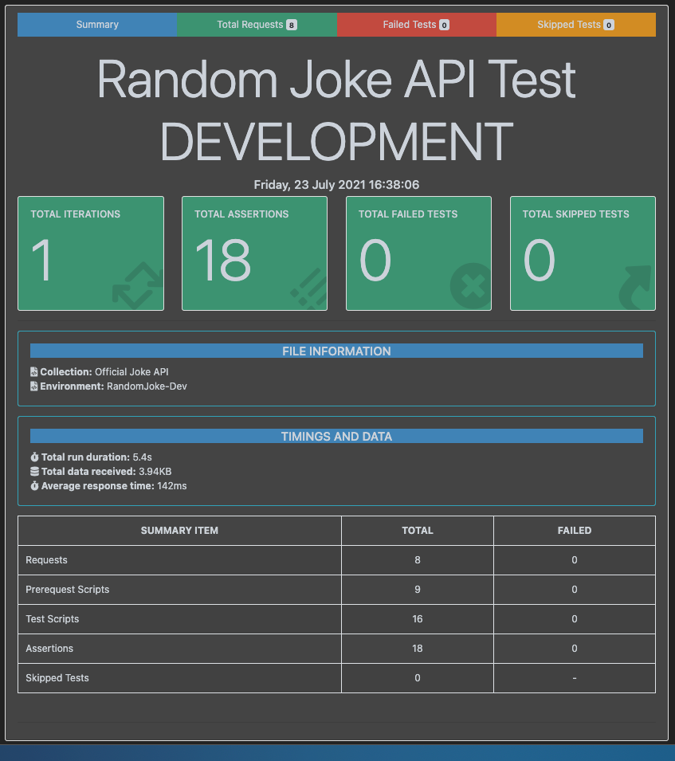

# Postman - Newman Boilerplate
API Testing with Postman and Newman.

> Note: You might find some items that are not optimized. Feel free to create a PR if you want to make some optimization.

---

## Features

- [Postman](https://www.postman.com/)
- [Newman](https://www.npmjs.com/package/newman)
- [Newman HTML Reporter Extra](https://www.npmjs.com/package/newman-reporter-htmlextra)
- [Chai for Assertions](https://www.chaijs.com/)
- [ESLint](https://eslint.org/)

---

## Important Notes before Running Test

- Running API Test using `node js`. You can use your own Imported Collection and Environment. These are controlled inside the `./conf/conf.js` file.

- Put your postman Collection in `./conf/collection/` and make sure the file name format is `<whatever file name you have>_collection.json`

- Put your Environment in `./conf/environment/` and make sure the file name format is `<environment>.<whatever name>_environment.json`

For more info, please visit [Newman API Reference](https://www.npmjs.com/package/newman#api-reference)

```javascript

newman.run({
  collection: require(String(config.Collection)),
  environment: require(String(config.Environment)),
  timeoutRequest: 60000,
  timeoutScript: 60000,
  delayRequest: 500,
  reporters: ['cli', 'htmlextra', 'junit'],
  reporter: {
    htmlextra: {
      export: './report/' + config.ReportName + '_' + config.Label + '.html',
      title: config.ReportName + ' ' + config.Label,
      darkTheme: true,
      skipSensitiveData: false,
    },
    junit: {
      export: './report/' + config.ReportName + '_' + config.Label + '.xml',
    },
  },
}).on('start', function(err, args) {
  console.log('running a collection...');
}).on('done', function(err, summary) {
  if (err || summary.error) {
    console.error('collection run encountered an error.');
  } else {
    console.log('collection run completed.');
  }
});

```

---

## Running Using Postman

1. Clone the repo — `https://github.com/ianoroceo/Postman-Newman.git`

2. Install Postman - `https://www.postman.com/downloads/`

3. Import [Collection](./conf/collection/) and [Environment](./conf/environment/)

    - [How to Import Collection and Environment](https://learning.postman.com/docs/postman/collections/importing-and-exporting-data/)

4. Running Tests using [Postman Collection Runs](https://learning.postman.com/docs/postman/collection-runs/intro-to-collection-runs/)
---

## Running Using Node

1. (Optional)Install nvm in your machine

    - [Install nvm on Windows](https://codeburst.io/nvm-for-windows-how-to-install-and-use-13b7a4209791)
    - [Install nvm on Mac](https://nodesource.com/blog/installing-node-js-tutorial-using-nvm-on-mac-os-x-and-ubuntu/)

2. Install nodeJs using nvm. You can also install nodeJS without using nvm. Here are some references if you are installing not using nvm

    - [Install nodeJs on Windows](https://phoenixnap.com/kb/install-node-js-npm-on-windows)
    - [Install nodeJs on Mac](https://www.webucator.com/how-to/how-install-nodejs-on-mac.cfm)


3. Install your favorite IDE. I used [VS Code](https://code.visualstudio.com/download) for this

4. On your terminal (mac) / cmd (windows), go to your project directory and install the Node Packages using `npm install`

5. Run your test. `npm run test:dev`. To run on other environments, please provide the environment argument
    - Note: before running your test, if you made changes please execute ESLint first

    ```console
    npm run lint-fix
    ```

6. Once all tests are executed, an aggregated report will be generated under `./report`.

7. Test Results can be also posted on Slack. Please read documentation how to setup [Slack Notification](./docs/SlackApp.md) 
## Report Examples




---

## References

- [Postman Test Scripts Documentation](https://learning.postman.com/docs/postman/scripts/test-scripts/)
- [Postman Building Workflows Documentation](https://learning.postman.com/docs/postman/collection-runs/building-workflows/)
- [Chai Documentation](https://www.chaijs.com/)
- [Newman Documentation](https://www.npmjs.com/package/newman)
- [Newman HTML Reporter Extra Documentation](https://www.npmjs.com/package/newman-reporter-htmlextra)
