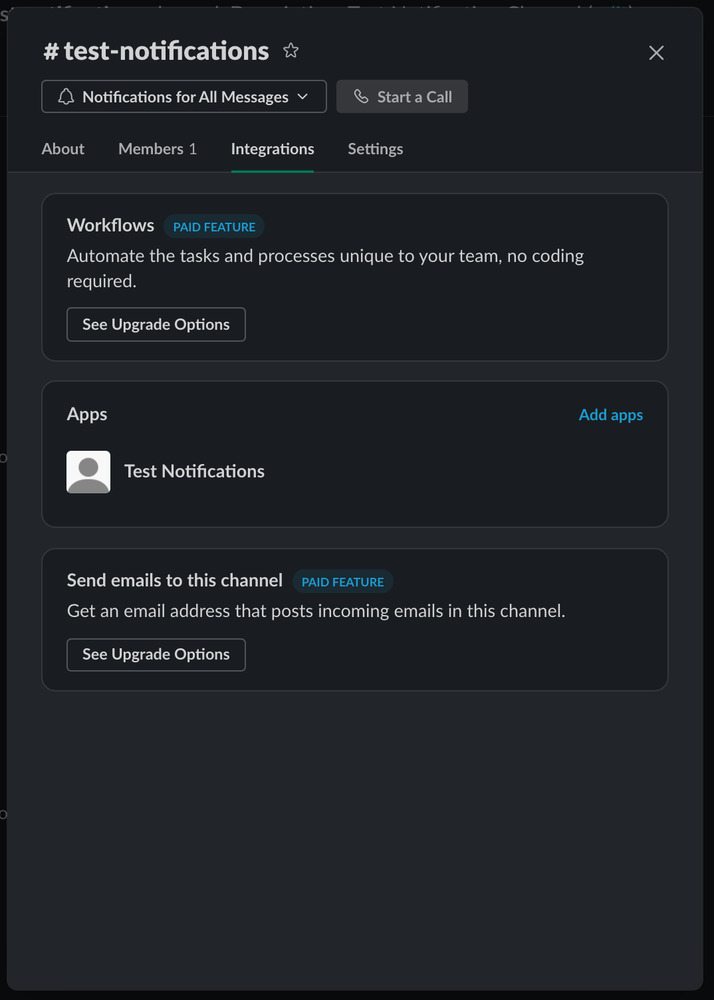
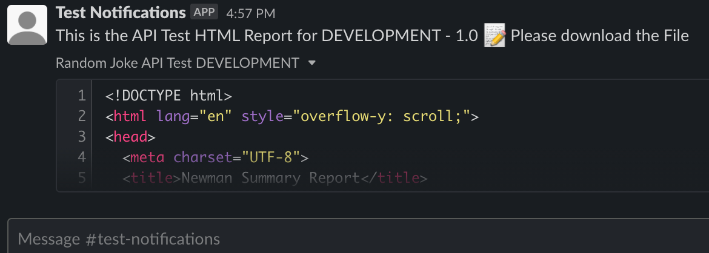

# Pushing Test Result to Slack

This document will help you integrate your test results to Slack. The Automation Solution is already hooked up for you with few modifications needed in [newman-slack.js](../newman-slack.js) and [postReport.js](../postReport.js)

> Note: I suggest signing up for a free Slack Workspace. Or you can use my workspace - https://thanatos10.slack.com/. Please reach out to me first if you want to be part of the workspace. Thank you

---

> Note: Before you start, make sure you have access to create Slack Apps on your Slack workspace. If you don't have access, you can ask your Slack Workspace Admin to build this for you.

---

## Creating your Slack App

I'm going to layout how to do it using the method I went through but for the full details, I would recommend reading the [Slack official guide](https://api.slack.com/interactivity/slash-commands).

- Go to [Your Slack App](https://api.slack.com/apps) page.
- Click on Create New App button.
- Select "From scratch" option and supply the App Name and Workspace you wanted your app be.

---

## Creating Slack Notification

- In order to create integrate your tests to Slack, open your created Slack App and click on __Add features and functionality__
- Click on Incoming Webhooks option
- Activate the Incoming Webhooks by clicking on the toggle
- Scroll down and Click on the Add New Webhook to Workspace
- Select the channel that you want the notification will be posted and click Allow
- A Webhook URL will created. Click copy
    

- Open [encrypt-decrypt.js](./encrypt-decrypt.js) and paste the Webhook URL. This is to encrypt the URL

    ```javascript
    const CryptoJS = require('crypto-js')
    const textString = '<PASTE THE WEBHOOK URL HERE>';
    const encrypt = CryptoJS.enc.Utf8.parse(textString); 
    const base64 = CryptoJS.enc.Base64.stringify(encrypt); 

    console.log(`Encrypyed = ${base64}`)

    const decrypt = CryptoJS.enc.Base64.parse(base64);
    const password = CryptoJS.enc.Utf8.stringify(decrypt);

    console.log(`Decrypted = ${password}`)
    ```

- On your terminal, run `npm run crypto` and copy the Encrypted value

    ```console
    ianoroceo Postman-Newman % npm run crypto

    > Postman-Newman@1.0.0 crypto
    > node ./docs/encrypt-decrypt.js

    Encrypyed = UEFTVEUgVEhFIFdFQkhPT0sgVVJMIEhFUkU=
    Decrypted = PASTE THE WEBHOOK URL HERE
    ianoroceo Postman-Newman % 
    ```

- Open [newman-slack.js](../newman-slack.js) and copy the Encrypted value to the uri constant

    ```javascript
    const uri = "UEFTVEUgVEhFIFdFQkhPT0sgVVJMIEhFUkU=";

    const CryptoJS = require("crypto-js");
    const encrypt = CryptoJS.enc.Base64.parse(uri);
    const url = encrypt.toString(CryptoJS.enc.Utf8);

    const slackUrl = url;
    ```

- Run your test by running `npm run start-slack:dev`
- If you followed the instruction correctly, you will see the Test Results being posted on the Slack Channel
    

---

## Posting Tests Results in Slack

- For us to be able to upload files to Slack, we will be utilizing the Bots capability of the Slack App you created
- Again open your created Slack App and on the left menu section, under Features, click on __OAuth & Permissions__
- Scroll down on the page until the Scopes section
- Click on the Add an OAuth Scope and type / select `files:write` scopes
- Once scope is added, scroll up and click "Reinstall to Workspace" This is just to reinstall / reload you Slack App with the new OAuth Scopes
- Once completed, copy the `Bot User OAuth Token`
- Doing the same steps we did for Slack notification, open [encrypt-decrypt.js](./encrypt-decrypt.js) and paste the Bot User OAuth Token. This is to encrypt the Bot Token. Make sure you type Bearer first before pasting the token

    ```javascript
    const CryptoJS = require('crypto-js')
    const textString = 'Bearer <PASTE THE BOT USER OAUTH TOKEN HERE>';
    const encrypt = CryptoJS.enc.Utf8.parse(textString); 
    const base64 = CryptoJS.enc.Base64.stringify(encrypt); 
    console.log(`Encrypyed = ${base64}`)
    ```

- On your terminal, run `npm run crypto` and copy the Encrypted value

    ```console
    ianoroceo Postman-Newman % npm run crypto

    > Postman-Newman@1.0.0 crypto
    > node ./docs/encrypt-decrypt.js

    Encrypyed = QmVhcmVyIDxQQVNURSBUSEUgQk9UIFVTRVIgT0FVVEggVE9LRU4gSEVSRT4=
    Decrypted = Bearer <PASTE THE BOT USER OAUTH TOKEN HERE>
    ianoroceo Postman-Newman % 
    ```

- Open [postReport.js](../postReport.js) and copy the Encrypted value to the authToken constant

    ```javascript
    const authToken =
    "QmVhcmVyIDxQQVNURSBUSEUgQk9UIFVTRVIgT0FVVEggVE9LRU4gSEVSRT4=";
    const CryptoJS = require("crypto-js");
    const encrypt = CryptoJS.enc.Base64.parse(authToken);
    const tokenD = encrypt.toString(CryptoJS.enc.Utf8);
    ```

- In [postReport.js](../postReport.js), change the channel ID to the Slack Channel you want the Test Report to be posted

    ```javascript
    data.append("channels", "<INSERT SLACK CHANNEL ID HERE>");
    ```
    - To get the Slack Channel Id, on your Slack Desktop App, click on the Channel Name. The Channel Id is at the bottom of the pop-up modal
    

- Before running [postReport.js](../postReport.js), make sure that your Slack App is present on the Channel. To add your Slack App, on your Slack Desktop App, click on the Channel Name and click on the Integrations Tab
    

- After running your tests, a HTML report is automatically generated after test. To post the HTML Report, run the command `npm run postReport`. 

- If you followed the instruction correctly, you will see the file being posted in the Slack Channel
    